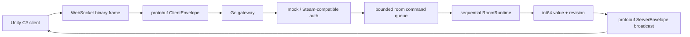

# Ruleshift

Ruleshift is a production-like Go backend for a future Steam-compatible Unity C# multiplayer card game.

The MVP is deliberately not a card game. It is an authoritative multiplayer state server that replicates one shared `int64` value per room through binary protobuf messages over WebSocket.

## Why This Is Not CRUD

The project demonstrates a real-time networking pipeline:



The server is authoritative: clients send intent, the server decides ordering, applies commands, increments room revision, and broadcasts the ordered state stream.

## Current Status

Implemented in this iteration:

- Go module and reviewable project skeleton.
- `cmd/gateway` entrypoint with config loading, structured logging, `/healthz`, and `/ws`.
- `cmd/botload` entrypoint with planned load-test flags.
- Auth interfaces with local mock provider and Steam Web API provider skeleton.
- Authoritative room state with `int64` value, monotonic `uint64` revision, Add/Set command apply logic, snapshots, deltas, and registry.
- Actor-like `RoomRuntime` owns state, accepts commands through a bounded queue, registers room-local delta subscribers, and broadcasts the same delta to joined clients.
- Gateway-owned websocket sessions implement `room.PlayerSink` with bounded outbound queues, non-blocking send, snapshot compaction for lagging clients, repeated slow-consumer disconnects, and graceful shutdown close.
- WebSocket gateway on `/ws` using Gorilla WebSocket with binary protobuf envelopes, mock auth, join room, snapshots, Add/Set commands, delta broadcast, app-level ping/pong, and basic client sequence checks.
- Reconnect/resume for rooms: `JoinRoomRequest.last_seen_revision` is compared with the authoritative room revision, stale clients receive a `StateSnapshot`, and reconnecting with the same authenticated `player_id` replaces the old session.
- Protobuf schema in `internal/protocol/proto/ruleshift.proto`.
- Generated Go and C# protobuf bindings.
- Direct protobuf encode/decode through generated Go and C# bindings.
- Makefile targets for Go and C# protobuf generation.
- Unit and integration tests for mock auth, config, protobuf WebSocket gateway flows, bounded send queues, integer command apply, room broadcast, invalid commands, concurrent command ordering, slow consumers, and runtime shutdown.
- Documentation for architecture, protocol, Steam integration, Unity integration, and performance plan.

Not implemented yet:

- Prometheus metrics and pprof endpoints.
- Bot load execution against the gateway.
- Card game mechanics. These are intentionally out of scope for the MVP.

## Run

```powershell
go test ./...
go run ./cmd/botload
go run ./cmd/gateway
```

The gateway defaults to `:8080`.

```powershell
$env:RULESHIFT_ADDR=":9090"
go run ./cmd/gateway
```

Health check:

```powershell
Invoke-WebRequest http://localhost:8080/healthz
```

WebSocket endpoint:

```text
ws://localhost:8080/ws
```

## Configuration

Environment variables:

| Variable | Default | Purpose |
| --- | --- | --- |
| `RULESHIFT_ADDR` | `:8080` | HTTP gateway listen address |
| `RULESHIFT_ENV` | `dev` | Environment label for logs |
| `RULESHIFT_MAX_MESSAGE_BYTES` | `65536` | Max protobuf WebSocket payload size |
| `RULESHIFT_ROOM_INPUT_QUEUE_SIZE` | `1024` | Bounded per-room command queue size |
| `RULESHIFT_SESSION_SEND_QUEUE_SIZE` | `256` | Bounded per-session send queue size |
| `RULESHIFT_AUTH_TIMEOUT` | `5s` | Auth deadline |
| `RULESHIFT_READ_TIMEOUT` | `30s` | HTTP read timeout |
| `RULESHIFT_WRITE_TIMEOUT` | `30s` | HTTP write timeout |
| `RULESHIFT_ENABLE_METRICS` | `true` | Future `/metrics` toggle |
| `RULESHIFT_ENABLE_PPROF` | `false` | Future pprof toggle |

## Protocol Direction

All client messages will be wrapped in `ClientEnvelope`. All server messages will be wrapped in `ServerEnvelope`. Each WebSocket binary payload carries one serialized protobuf envelope with no extra application-level length prefix.

The protobuf schema lives in [internal/protocol/proto/ruleshift.proto](internal/protocol/proto/ruleshift.proto).

Generate protobuf bindings after installing `protoc` and `protoc-gen-go`:

```powershell
.\scripts\proto.ps1
```

The script prepends the WinGet-installed `protoc.exe` path for the current run, so generation works even if the already-running shell has not refreshed PATH.

## Development Roadmap

1. Phase 0: repository discovery, architecture plan, documentation, project structure.
2. Phase 1: Go skeleton, config, structured logging, entrypoints, package boundaries.
3. Phase 2: protobuf generation and direct protobuf wire payloads.
4. Phase 3: authoritative integer room model and reducer tests.
5. Phase 4: actor-like room runtime, bounded queues, slow consumer behavior.
6. Phase 5: WebSocket gateway integration tests.
7. Phase 6: Steam-compatible authentication implementation and httptest coverage.
8. Phase 7: reconnect/resume with snapshots.
9. Phase 8: event log and replay.
10. Phase 9: Unity C# client skeleton.
11. Phase 10: observability and profiling.
12. Phase 11: bot load tests.
13. Phase 12: test and benchmark strategy.
14. Phase 13: interview polish and performance report.

## Interview Angle

Ruleshift is meant to show:

- authoritative multiplayer server design;
- ordered room command processing;
- bounded queues and backpressure;
- cross-language protobuf protocol design;
- reconnect and revision-based state recovery;
- observability and load-test thinking;
- clean package boundaries for a future domain layer.

