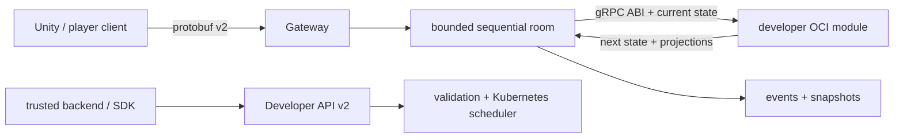

# Ruleshift

Ruleshift is a Go authoritative multiplayer state service for game developers.
Player clients send protobuf commands; Ruleshift orders them per room, invokes a
developer-owned stateless game module, persists the result, and broadcasts one
coherent revision stream.

The core is game-agnostic. A developer can add a fourth game from a separate
repository by publishing a gRPC/protobuf OCI image; rebuilding Ruleshift is not
required.

## Project website

The developer-facing landing page and documentation index live in [`site`](site).
It is a static Vite build deployed to GitHub Pages by
[`pages.yml`](.github/workflows/pages.yml).

```powershell
cd site
npm install
npm run dev
```

## What the MVP demonstrates

- binary protobuf WebSocket protocol v2;
- authoritative, sequential room processing with bounded queues;
- opaque module state and recipient-specific private/public/full projections;
- immutable room pinning to developer/module/version/image digest;
- snapshot plus generic event replay through the exact pinned module version;
- Developer API for OCI publication, validation, activation and room creation;
- PostgreSQL control DB plus isolated module databases;
- hardened multi-tenant Kubernetes module scheduling.



## Contracts

- Player schema: [`internal/protocol/proto/ruleshift.proto`](internal/protocol/proto/ruleshift.proto)
- Module ABI: [`internal/moduleruntime/proto/module_runtime.proto`](internal/moduleruntime/proto/module_runtime.proto)
- Module guide: [`docs/module-development.md`](docs/module-development.md)
- Card Game v2 example: [`docs/cardgame-module.md`](docs/cardgame-module.md)
- Architecture: [`docs/architecture.md`](docs/architecture.md)
- Protocol details: [`docs/protocol.md`](docs/protocol.md)

The production WebSocket endpoint is `/v2/ws`. Protocol v1 is intentionally a
breaking change and is rejected.

## Run tests

```powershell
go test ./...
go vet ./...
```

The external examples and their byte-level conformance vectors are tested in
the normal Go suite:

- `examples/modules/xiangqi`
- `examples/modules/hiddennumber`
- `examples/modules/cardgame`

Build an example from the repository root:

```powershell
docker build -f examples/modules/hiddennumber/Dockerfile `
  -t localhost:5000/hiddennumber:1.0.0 .
```

## Run the production gateway

Protocol v2 requires PostgreSQL and Kubernetes. Run `cmd/gateway` inside the
cluster, or supply `RULESHIFT_KUBECONFIG` in a development environment that can
resolve and reach cluster Services.

Required configuration:

```text
RULESHIFT_DATABASE_URL
RULESHIFT_DATABASE_ADMIN_URL
RULESHIFT_DEVELOPER_API_KEY
RULESHIFT_KUBECONFIG        # optional in-cluster
```

```powershell
go run ./cmd/gateway
```

Endpoints:

```text
GET  /healthz
GET  /readyz
WS   /v2/ws
PUT  /v2/developer/registry-credentials/{name}
POST /v2/developer/modules
POST /v2/developer/modules/{module}/versions
GET  /v2/developer/modules/{module}/versions/{version}
GET  /v2/developer/modules/{module}/versions/{version}/validation
POST /v2/rooms
GET  /v2/rooms/{room_id}
```

Operational endpoints use a separate private listener and must not be exposed
to the internet:

```text
GET  /metrics
GET  /internal/v1/rooms
GET  /internal/v1/rooms/{public_room_ref}
```

Set `RULESHIFT_OPERATIONS_ADDR` and a secret
`RULESHIFT_PUBLIC_ROOM_REF_KEY` of at least 32 bytes. Public monitoring uses the
separate `cmd/observability-api` service; it exposes only aggregate overview and
payload-free room projections. Production k3s manifests live in
[`deploy/k3s/observability`](deploy/k3s/observability); the VPS does not need a
Git checkout. See [`docs/observability.md`](docs/observability.md).

Developer keys belong only in Unity Editor, CI, or a trusted backend. Player
builds authenticate through the player protocol and cannot create rooms or
publish modules.

## Persistence reset

This is a pre-production breaking migration. Old local room data is not
migrated. Reset the Docker PostgreSQL volume before first v2 startup:

```powershell
docker compose down -v
```

## Security and failure behavior

Each tenant receives a separate namespace, pull Secrets, ResourceQuota,
LimitRange and default-deny network policy. Module pods run as non-root with
read-only root filesystem, RuntimeDefault seccomp, all capabilities dropped,
no service-account token, no host mounts and no external egress.

Module timeout/error never changes state or revision. Malformed, oversized or
wrong-type responses are protocol violations; three within 60 seconds degrade
the version and prevent new rooms from using it.

An architecture test ensures production core never imports code from
`examples/modules`.
