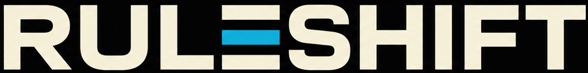
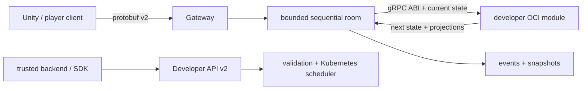

<div align="center">
  <a href="site/">
    
  </a>

  <h1>Authoritative multiplayer state — without drift</h1>

  <p>
    Go-сервис для разработчиков игр, который принимает protobuf-команды,
    последовательно применяет их в комнате и раздаёт всем клиентам одну
    согласованную ленту ревизий.
  </p>

  <p>
    <a href="go.mod">
      
    </a>
    <a href="internal/protocol/proto/ruleshift.proto">
      
    </a>
  </p>

  <p>
    <a href="https://ruleshift.ru/">Сайт проекта</a> ·
    <a href="docs/ru/README.md">Документация на русском</a> ·
    <a href="docs/">English documentation</a>
  </p>
</div>

## Зачем Ruleshift

В многопользовательской игре клиент не должен быть источником истины. Ruleshift
выносит авторитетное состояние на сервер: клиенты отправляют намерения, сервер
упорядочивает команды, вызывает stateless-модуль игры, сохраняет результат и
транслирует его всем участникам комнаты.

Игра подключается как внешнее gRPC/protobuf OCI-изображение. Поэтому игровой
модуль можно разрабатывать и выпускать отдельно — ядро Ruleshift пересобирать
не требуется.



## Быстрая навигация

| Если вы хотите… | Начните здесь |
| --- | --- |
| Понять устройство системы | [Архитектура](docs/architecture.md) · [русская версия](docs/ru/architecture.md) |
| Подключить player client | [Unity client](docs/unity-client.md) · [клиент Unity на русском](docs/ru/unity-client.md) |
| Создать и опубликовать игровой модуль | [Module development](docs/module-development.md) · [русская версия](docs/ru/module-development.md) |
| Разобраться с wire protocol | [Protocol v2](docs/protocol.md) · [русская версия](docs/ru/protocol.md) |
| Управлять модулями и комнатами | [Developer API v2](docs/developer-api.md) · [русская версия](docs/ru/developer-api.md) |
| Подключить Steam-аутентификацию | [Steam integration](docs/steam-integration.md) · [русская версия](docs/ru/steam-integration.md) |
| Настроить production-наблюдаемость | [Observability](docs/observability.md) · [k3s deployment](deploy/k3s/observability/README.md) |
| Посмотреть модель хранения | [Database](docs/database.md) · [русская версия](docs/ru/database.md) |
| Изучить benchmark scope | [Performance report](docs/performance-report.md) · [русская версия](docs/ru/performance-report.md) |

## Что демонстрирует MVP

- бинарный WebSocket-протокол на protobuf v2;
- последовательную обработку команд в комнате с bounded queues;
- непрозрачное состояние модуля и recipient-specific public/private/full projections;
- immutable pinning комнаты на developer, module, version и image digest;
- snapshots и generic event replay через точно зафиксированную версию модуля;
- Developer API v2 для публикации OCI-модулей, валидации, активации и создания комнат;
- PostgreSQL control DB и изолированные module databases;
- tenant isolation и безопасное планирование модулей в Kubernetes.

## Быстрый старт

Требования: Go 1.26, Docker и PostgreSQL для локального запуска gateway.

```powershell
# Запустить локальный PostgreSQL
docker compose up -d postgres

# Проверить проект
go test ./...
go vet ./...

# Запустить gateway
go run ./cmd/gateway
```

Для production gateway нужны PostgreSQL и Kubernetes. Основные переменные
окружения:

```text
RULESHIFT_DATABASE_URL
RULESHIFT_DATABASE_ADMIN_URL
RULESHIFT_DEVELOPER_API_KEY
RULESHIFT_KUBECONFIG        # опционально при запуске внутри кластера
```

Полный список endpoint'ов и конфигурации находится в [Developer API](docs/developer-api.md)
и [документации по observability](docs/observability.md).

## Контракты и примеры

- [Player protocol schema](internal/protocol/proto/ruleshift.proto)
- [Module Runtime ABI](internal/moduleruntime/proto/module_runtime.proto)
- [OpenAPI: Developer API](api/developer.openapi.yaml)
- [OpenAPI: Observability API](api/observability.openapi.yaml)
- [External modules](examples/modules/README.md)
- [Hidden Number example](examples/modules/hiddennumber)
- [Xiangqi example](examples/modules/xiangqi)
- [Card Game v2 example](examples/modules/cardgame)
- [Unity Developer SDK](sdk/unity/com.ruleshift.developer/README.md)
- [.NET Developer SDK](sdk/dotnet/Ruleshift.Developer/README.md)

Production WebSocket endpoint: `/v2/ws`. Протокол v1 намеренно несовместим и
отклоняется сервером.

## Высокопроизводительная основа

Горячий путь построен вокруг небольшого количества предсказуемых компонентов:
bounded queues, один последовательный room runtime, бинарная сериализация
protobuf и отсутствие сетевых записей внутри room loop. Долгие операции используют
`context.Context`, а ошибки игрового модуля не меняют состояние и revision.

Измерения и команды для воспроизведения находятся в [Performance report](docs/performance-report.md).

## Безопасность и отказоустойчивость

Каждый tenant получает отдельный namespace, pull Secret, ResourceQuota,
LimitRange и default-deny network policy. Module pods запускаются без root,
с read-only filesystem, RuntimeDefault seccomp, без capabilities, service-account
token и внешнего egress.

Некорректный, слишком большой или несоответствующий типу ответ модуля считается
нарушением протокола. После трёх таких нарушений за 60 секунд версия деградирует,
и новые комнаты не смогут её использовать.

## Статус проекта

Уже реализовано: authoritative room runtime, protobuf v2 gateway, persistence,
24-часовые коды приглашения комнат, module ABI, Developer API v2, OCI module
lifecycle, Kubernetes scheduling, observability, Unity/.NET SDK и conformance
examples.

В дальнейших итерациях: расширение SDK для player-клиентов, полноценный
Steam-поток авторизации, более глубокие load tests и расширение card-game state.

## Лицензия и вклад

Проект находится в активной разработке. Перед изменением архитектуры сверяйтесь
с [AGENTS.md](AGENTS.md) и соответствующим разделом [документации](docs/ru/README.md).
