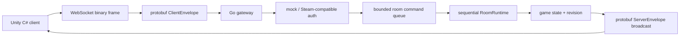

# Ruleshift

Ruleshift is a production-like Go backend for a future Steam-compatible Unity C# multiplayer card game.

The MVP is deliberately still not the final card game. It is now an authoritative multiplayer room server that runs a pluggable game module; the current module is Xiangqi, backed by `github.com/laines-it/xiangqi-go` through its declared Go module path.

## Why This Is Not CRUD

The project demonstrates a real-time networking pipeline:



The server is authoritative: clients send intent, the server decides ordering, applies commands, increments room revision, and broadcasts the ordered state stream.

## Current Status

Implemented in this iteration:

- Go module and reviewable project skeleton.
- `cmd/gateway` entrypoint with config loading, structured logging, `/healthz`, `/readyz`, optional minimal `/metrics`, graceful shutdown, and `/ws`.
- `cmd/client` CLI client for manual protobuf WebSocket testing from a terminal.
- `cmd/botload` entrypoint with planned load-test flags.
- Auth interfaces with local mock provider and Steam Web API provider skeleton.
- In-memory matchmaking orchestration layer with ticket creation, idempotency, cancellation, match formation, assignment TTL, lifecycle transitions, and event audit records.
- Atomic in-memory game server allocator with indexed game/build pools, seat reservations, reservation TTL cleanup, idempotent reservation retry by match id, and server failure handling.
- HMAC-signed connect tokens with assignment, match, server, player, and expiry claims.
- Authoritative room state with pluggable game state, monotonic `uint64` revision, game command apply logic, snapshots, deltas, and registry.
- Xiangqi module using the Go engine for legal move generation and `DoMove`, with first/second joined players seated as red/black.
- Actor-like `RoomRuntime` owns state, accepts commands through a bounded queue, registers room-local delta subscribers, and broadcasts the same delta to joined clients.
- Gateway-owned websocket sessions implement `room.PlayerSink` with bounded outbound queues, non-blocking send, snapshot compaction for lagging clients, repeated slow-consumer disconnects, and graceful shutdown close.
- WebSocket gateway on `/ws` using Gorilla WebSocket with binary protobuf envelopes, mock auth, join room, snapshots, `DoMove`/`Resign`/`OfferDraw` commands, delta broadcast, app-level ping/pong, and basic client sequence checks.
- Reconnect/resume for rooms: `JoinRoomRequest.last_seen_revision` is compared with the authoritative room revision, stale clients receive a `StateSnapshot`, and reconnecting with the same authenticated `player_id` replaces the old session.
- Append-only room event log with sequence-numbered `RoomEvent` records, `InMemoryEventStore`, and replay that restores game state by reapplying module commands.
- PostgreSQL control database for SaaS developers, module registrations, users, and provider identities.
- Automatically provisioned database per developer/module, with immutable module-owned migrations, durable room/member projections, room events, and restart recovery.
- Authenticated developer REST API with declarative module schemas and bounded table reads/writes; raw SQL and PostgreSQL credentials stay server-side.
- Go client package and Editor-only Unity Package Manager SDK for using Ruleshift locally or as a hosted service.
- Unity-compatible C# network skeleton with `MatchClient`, `ProtocolCodec`, mock auth tickets, generated protobuf bindings, and reconnect using `lastSeenRevision`.
- Protobuf schema in `internal/protocol/proto/ruleshift.proto`.
- Generated Go and C# protobuf bindings.
- Direct protobuf encode/decode through generated Go and C# bindings.
- Makefile targets for Go and C# protobuf generation.
- Unit and integration tests for mock auth, config, protobuf WebSocket gateway flows, bounded send queues, game command apply, room broadcast, invalid commands, concurrent command ordering, slow consumers, and runtime shutdown.
- Documentation for architecture, protocol, Steam integration, Unity integration, and performance plan.

Not implemented yet:

- Public matchmaking HTTP/protobuf API handlers wired into `cmd/gateway`.
- Durable game/build registry and durable matchmaking/session storage (room and identity persistence are implemented).
- Real game server launcher or container allocator.
- Full Prometheus metrics and pprof endpoints.
- Bot load execution against the gateway.
- Card game mechanics. These are intentionally out of scope for this MVP.

## Run

```powershell
go test ./...
go run ./cmd/botload
go run ./cmd/gateway
```

For PostgreSQL-backed local startup, use `docker compose up --build`. Game developers then use `http://localhost:8080` through the Go or Unity SDK. See [docs/developer-api.md](docs/developer-api.md).

The gateway defaults to `:8080`.

```powershell
$env:RULESHIFT_ADDR=":9090"
go run ./cmd/gateway
```

Health check:

```powershell
Invoke-WebRequest http://localhost:8080/healthz
Invoke-WebRequest http://localhost:8080/readyz
Invoke-WebRequest http://localhost:8080/metrics
```

Developer service API: `http://localhost:8080/v1/developer/`. Its OpenAPI contract is [api/developer.openapi.yaml](api/developer.openapi.yaml); SDK usage is documented in [docs/developer-api.md](docs/developer-api.md).

Step-by-step module authoring, including a complete authoritative reducer example, is documented in [docs/module-development.md](docs/module-development.md).

Docker VPS deploy notes: [docs/vps-deploy.md](docs/vps-deploy.md).

WebSocket endpoint:

```text
ws://localhost:8080/ws
```

Manual CLI checks:

```powershell
go run ./cmd/client -addr ws://localhost:8080/ws -ticket mock:player-1 -room demo -op get
go run ./cmd/client -addr ws://localhost:8080/ws -ticket mock:player-1 -room demo -op move -move h2e2
go run ./cmd/client -addr ws://localhost:8080/ws -ticket mock:watcher -room demo -op watch
```

Interactive console for repeated checks:

```powershell
go run ./cmd/console -addr ws://localhost:8080/ws -ticket mock:player-1 -room demo
```

Then type short commands such as `get`, `move h2e2`, `resign`, `draw`, `room demo-2`, or `status`.
Windows packaging notes: [docs/client-packaging.md](docs/client-packaging.md).

For a LAN server started with `RULESHIFT_ADDR=0.0.0.0:8080`, replace `localhost` with the server IPv4 address, for example `ws://192.168.1.50:8080/ws`.

More examples: [docs/cli-client.md](docs/cli-client.md).

## Configuration

Environment variables:

| Variable | Default | Purpose |
| --- | --- | --- |
| `RULESHIFT_ADDR` | `:8080` | HTTP gateway listen address |
| `RULESHIFT_ENV` | `dev` | Environment label for logs |
| `RULESHIFT_DATABASE_URL` | empty | Control/default PostgreSQL URL; empty keeps in-memory mode |
| `RULESHIFT_DATABASE_ADMIN_URL` | derived from database URL | PostgreSQL provisioning URL with `CREATEDB` |
| `RULESHIFT_MODULE_DATABASE_PREFIX` | `ruleshift_module_` | Prefix for per-developer/module databases |
| `RULESHIFT_DEVELOPER_ID` | `default` | Safe tenant identifier used in module database names |
| `RULESHIFT_DEVELOPER_NAME` | `Default developer` | Tenant display name in the control database |
| `RULESHIFT_DEVELOPER_API_KEY` | empty | Bearer key enabling the tenant-scoped developer API; requires PostgreSQL |
| `RULESHIFT_MAX_MESSAGE_BYTES` | `65536` | Max protobuf WebSocket payload size |
| `RULESHIFT_ROOM_INPUT_QUEUE_SIZE` | `1024` | Bounded per-room command queue size |
| `RULESHIFT_SESSION_SEND_QUEUE_SIZE` | `256` | Bounded per-session send queue size |
| `RULESHIFT_AUTH_TIMEOUT` | `5s` | Auth deadline |
| `RULESHIFT_READ_TIMEOUT` | `30s` | HTTP read timeout |
| `RULESHIFT_WRITE_TIMEOUT` | `30s` | HTTP write timeout |
| `RULESHIFT_SHUTDOWN_TIMEOUT` | `10s` | Graceful shutdown deadline |
| `RULESHIFT_ENABLE_METRICS` | `true` | Enable minimal `/metrics` endpoint |
| `RULESHIFT_ENABLE_PPROF` | `false` | Future pprof toggle |

## Matchmaking And Assignment Flow

The new orchestration layer is currently an internal Go package, ready to be exposed by future API handlers:

1. Create a ticket with `game_id`, `build_id`, `player_id`, optional idempotency key, and TTL.
2. The matcher groups queued tickets from the same game/build pool into a match.
3. The allocator atomically reserves server seats and creates player assignments.
4. Each assignment returns `endpoint`, `match_id`, `server_id`, and a signed connect token.
5. The game server validates the connect token before accepting the player, then reports lifecycle progress toward `connecting`, `in_game`, and `ended` or `failed`.

## Protocol Direction

All client messages will be wrapped in `ClientEnvelope`. All server messages will be wrapped in `ServerEnvelope`. Each WebSocket binary payload carries one serialized protobuf envelope with no extra application-level length prefix.

The protobuf schema lives in [internal/protocol/proto/ruleshift.proto](internal/protocol/proto/ruleshift.proto).

Generate protobuf bindings after installing `protoc` and `protoc-gen-go`:

```powershell
.\scripts\proto.ps1
```

The script prepends the WinGet-installed `protoc.exe` path for the current run, so generation works even if the already-running shell has not refreshed PATH.

## Development Roadmap

1. Phase 0: repository discovery, architecture plan, documentation, project structure.
2. Phase 1: Go skeleton, config, structured logging, entrypoints, package boundaries.
3. Phase 2: protobuf generation and direct protobuf wire payloads.
4. Phase 3: authoritative game room model and reducer tests.
5. Phase 4: actor-like room runtime, bounded queues, slow consumer behavior.
6. Phase 5: WebSocket gateway integration tests.
7. Phase 6: Steam-compatible authentication implementation and httptest coverage.
8. Phase 7: reconnect/resume with snapshots.
9. Phase 8: event log and replay.
10. Phase 9: Unity C# client skeleton.
11. Phase 10: observability and profiling.
12. Phase 11: bot load tests.
13. Phase 12: test and benchmark strategy.
14. Phase 13: interview polish and performance report.

## Interview Angle

Ruleshift is meant to show:

- authoritative multiplayer server design;
- ordered room command processing;
- bounded queues and backpressure;
- cross-language protobuf protocol design;
- reconnect and revision-based state recovery;
- append-only event logs and replay;
- observability and load-test thinking;
- clean package boundaries for a future domain layer.

