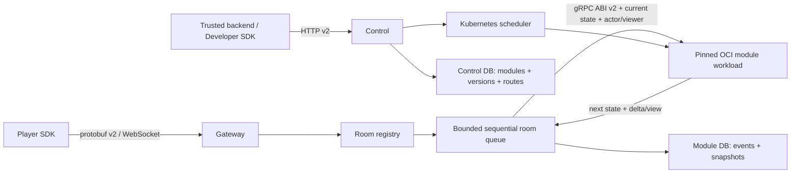

# Architecture

Ruleshift is an authoritative multiplayer state service. Game rules are external
stateless OCI modules; core is game-agnostic.

## Package boundaries

- `internal/module`: opaque state, module reference, ABI client and limits;
- `internal/roomcore`: state ownership, ordered revision stream and replay;
- `internal/gatewayv2`: player transport only;
- `internal/controlplane`: publication, validation and activation lifecycle;
- `internal/scheduler/kubernetes`: tenant isolation and module workloads;
- `internal/storage/postgres`: control and module persistence;
- `examples/modules`: independently built OCI services, never imported by core.

There are no in-process game reducers in core. Hidden Number, Xiangqi and Card
Game live under `examples/modules` and are built as independent OCI services.

## Version and room invariants

A room route pins `developer_id + module_id + version + image_digest`. New rooms
resolve active version; existing rooms never switch automatically. A degraded
active version is excluded from room creation and the latest healthy inactive
version is used as fallback.

The room runtime changes in-memory state only after the module call succeeds,
and persistence commits. Events, state revision and the periodic snapshot are
one module-database transaction. Recipient projections currently run after that
commit, so a projection failure does not roll back an accepted transition.
Snapshots are saved at revision 0, every 100 revisions and on graceful eviction
(eviction hook is the persistence boundary).

The module process stores no current match data and has no room/lobby lifecycle
RPCs. Core persists the room's opaque canonical state and its separate
authenticated player-to-seat roster. A room remains `lobby` until all required
seats are filled. Lobby disconnects free a seat; once `active`, a seat survives
disconnect and is reused by the same authenticated player on reconnect.

## Kubernetes isolation

Each developer receives a stable hashed namespace with ResourceQuota,
LimitRange and default-deny ingress/egress. For the MVP, each validated version
receives a Deployment and ClusterIP Service without an explicit replica-count
policy; Kubernetes applies its default. An HA replica policy is deferred until
after the MVP. Pods run non-root with read-only root filesystem,
RuntimeDefault seccomp, no capabilities, no privilege
escalation, no service-account token, no host mounts and no external egress.

Registry credentials exist only as tenant `dockerconfigjson` Secrets. The
cluster must enable encryption-at-rest for Secrets.

## Failure model

- module rejection: stable `command_rejected`, no revision change;
- timeout/unavailability: stable `module_unavailable`, no revision change;
- malformed, oversized or wrong-type response: protocol violation;
- three violations in 60 seconds: version becomes degraded;
- gateway restart: load route and persistent roster, exact module version,
  latest snapshot, then replay later generic command events.

All queues are bounded, room processing is sequential, and network writers never
own authoritative room state.

## Monitoring boundary

The public GitHub Pages portal reads only `observability-api`. That service runs
fixed Prometheus queries and proxies payload-free room projections from the
gateway's private operations listener. The listener reads atomic runtime
diagnostics and never submits work to a room queue.

Prometheus, Loki, PostgreSQL, `/metrics`, and `/internal/v1/*` remain on the
private deployment network. Public room URLs use an HMAC-derived
`public_room_ref`; internal room IDs, state, commands, player identities, and
secrets are not part of the monitoring contract.
