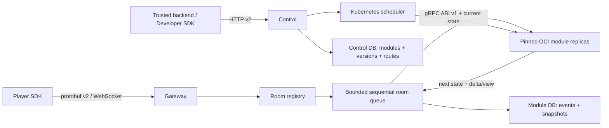

# Architecture

Ruleshift is an authoritative multiplayer state service. Game rules are external
stateless OCI modules; core is game-agnostic.

## Package boundaries

- `internal/module`: opaque state, module reference, ABI client and limits;
- `internal/roomcore`: state ownership, ordered revision stream and replay;
- `internal/gatewayv2`: player transport only;
- `internal/controlplane`: publication, validation and activation lifecycle;
- `internal/scheduler/kubernetes`: tenant isolation and module workloads;
- `internal/storage/postgres`: control and module persistence;
- `examples/modules`: independently built OCI services, never imported by core.

There are no in-process game reducers in core. Hidden Number, Xiangqi and Card
Game live under `examples/modules` and are built as independent OCI services.

## Version and room invariants

A room route pins `developer_id + module_id + version + image_digest`. New rooms
resolve active version; existing rooms never switch automatically. A degraded
active version is excluded from room creation and the latest healthy inactive
version is used as fallback.

The room runtime changes in-memory state only after the module call succeeds,
all projections succeed, and persistence commits. Events, state revision and
the periodic snapshot are one module-database transaction. Snapshots are saved
at revision 0, every 100 revisions and on graceful eviction (eviction hook is
the persistence boundary).

## Kubernetes isolation

Each developer receives a stable hashed namespace with ResourceQuota,
LimitRange and default-deny ingress/egress. Each validated version receives a
two-replica Deployment and ClusterIP Service. Pods run non-root with read-only
root filesystem, RuntimeDefault seccomp, no capabilities, no privilege
escalation, no service-account token, no host mounts and no external egress.

Registry credentials exist only as tenant `dockerconfigjson` Secrets. The
cluster must enable encryption-at-rest for Secrets.

## Failure model

- module rejection: stable `command_rejected`, no revision change;
- timeout/unavailability: stable `module_unavailable`, no revision change;
- malformed, oversized or wrong-type response: protocol violation;
- three violations in 60 seconds: version becomes degraded;
- gateway restart: load route, exact module version, latest snapshot, then replay
  later generic lifecycle/command events.

All queues are bounded, room processing is sequential, and network writers never
own authoritative room state.
