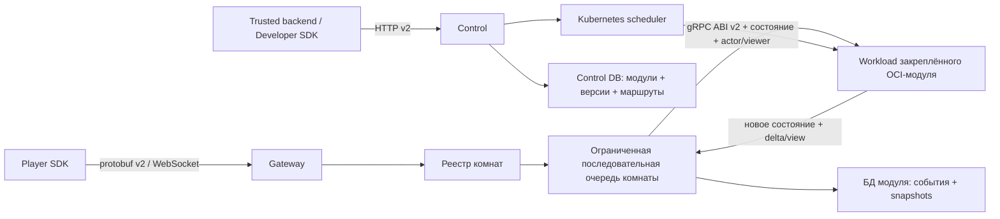

# Архитектура

Ruleshift — authoritative-сервис многопользовательского состояния. Правила игр
реализуются внешними stateless OCI-модулями; core не зависит от конкретной игры.

## Границы пакетов

- `internal/module`: opaque state, ссылка на модуль, ABI client и лимиты;
- `internal/roomcore`: владение состоянием, упорядоченный поток ревизий и replay;
- `internal/gatewayv2`: только player transport;
- `internal/controlplane`: публикация, validation и lifecycle активации;
- `internal/scheduler/kubernetes`: изоляция tenants и workloads модулей;
- `internal/storage/postgres`: control- и module-persistence;
- `examples/modules`: независимо собираемые OCI-сервисы, которые core никогда не импортирует.

В core нет встроенных игровых reducers. Hidden Number, Xiangqi и Card Game
находятся в `examples/modules` и собираются как отдельные OCI-сервисы.

## Инварианты версий и комнат

Маршрут комнаты закрепляет комбинацию
`developer_id + module_id + version + image_digest`. Новые комнаты используют
active version; существующие комнаты никогда не переключаются автоматически.
Degraded active version исключается из создания комнат, а fallback выбирается
из последней healthy inactive version.

Room runtime меняет состояние в памяти только после успешного вызова модуля и
persistence commit. Событие, ревизия состояния и периодический snapshot
записываются одной транзакцией в БД модуля. Recipient projections сейчас
выполняются после commit, поэтому их ошибка не откатывает уже принятую
транзакцию. Snapshots сохраняются на ревизии 0, каждые 100 ревизий и при
graceful eviction.

Процесс модуля не хранит текущие матчи и не имеет RPC жизненного цикла
комнаты/lobby. Core отдельно хранит opaque canonical state комнаты и устойчивый
roster `player_id <-> seat_index`. Комната остаётся в `lobby`, пока не заняты
все места. Отключение в lobby освобождает место; после перехода в `active`
место сохраняется и возвращается тому же аутентифицированному игроку при
reconnect.

## Изоляция Kubernetes

Каждый разработчик получает namespace со стабильным hash, ResourceQuota,
LimitRange и default-deny правилами ingress/egress. В MVP каждая validated version
получает Deployment и ClusterIP Service без явно заданной политики количества
реплик; Kubernetes применяет значение по умолчанию. HA-политика реплик отложена
до этапа после MVP. Pods запускаются не от root, с read-only root filesystem,
seccomp `RuntimeDefault`, без capabilities,
privilege escalation, service-account token, host mounts и external egress.

Registry credentials существуют только как tenant-scoped
`dockerconfigjson` Secrets. В кластере должно быть включено encryption-at-rest
для Secrets.

## Модель ошибок

- отказ модуля принять команду: стабильная ошибка `command_rejected`, ревизия не меняется;
- timeout или недоступность: `module_unavailable`, ревизия не меняется;
- malformed, oversized или wrong-type response: protocol violation;
- три нарушения за 60 секунд: версия становится degraded;
- рестарт gateway: загружаются route и устойчивый roster, точная версия модуля,
  последний snapshot, затем проигрываются последующие generic command events.

Все очереди ограничены, обработка комнаты последовательна, а network writers
никогда не владеют authoritative state комнаты.
